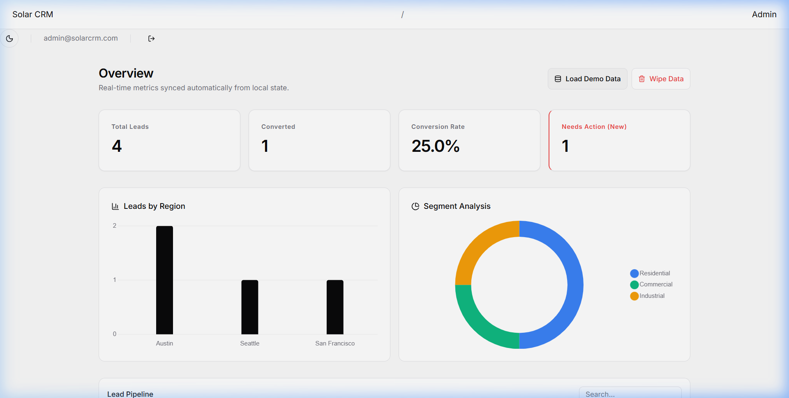
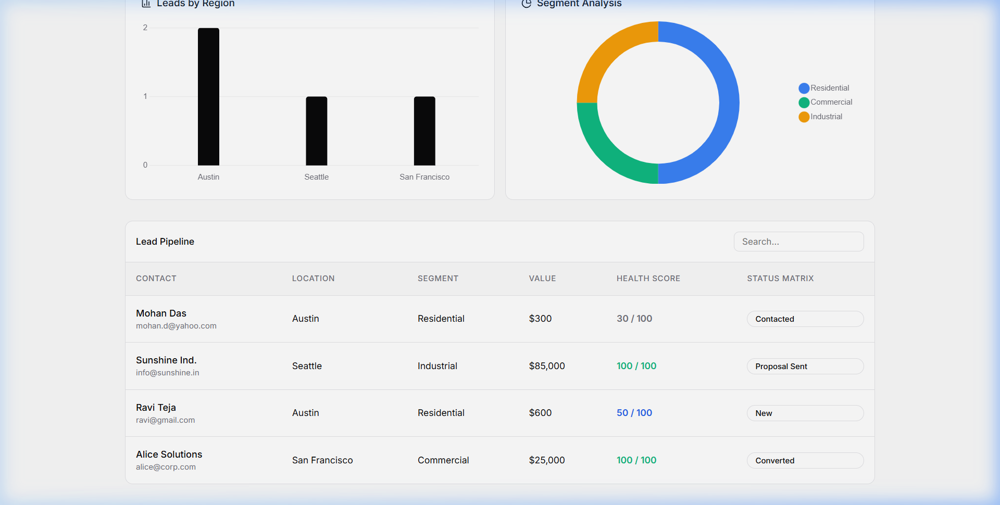
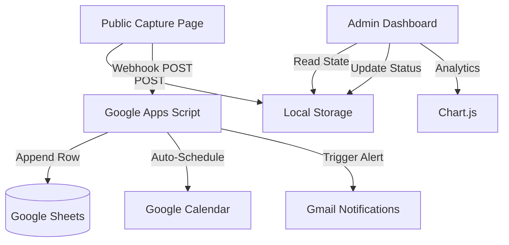

# ☀️ Solar CRM: Industrial-Grade Lead Management System

[](https://solarbae-crm.vercel.app)
[](https://github.com/chaitanyashete03/automated-lead-management-crm)

## 🚀 Executive Summary
In the high-stakes solar energy industry, **lead leakage** (failing to follow up within 48 hours) can result in a 30% loss in potential revenue. **Solar CRM** is a professional-grade, serverless lead management solution engineered to eliminate manual overhead and maximize conversion rates.

By leveraging a **Hybrid-Cloud Architecture**, this system provides real-time lead scoring, automated email/calendar synchronization, and advanced data visualization—all while maintaining a **zero-cost operational footprint**.

---

## 📸 System Preview


*Figure 1: High-fidelity administrative dashboard featuring real-time KPI metrics and geographic demand heatmaps.*


*Figure 2: The intelligent lead pipeline with automated health scoring and status matrix management.*

---

## ✨ Core Features
*   **🎯 Intelligent Lead Scoring**: A proprietary algorithm that automatically prioritizes high-value commercial and industrial leads based on energy consumption metrics.
*   **🌗 Premium SaaS UX/UI**: A modern, monochromatic "Linear-style" interface featuring seamless Light/Dark mode transitions.
*   **☁️ Serverless Automation**: Integrated Google Apps Script webhooks that handle instant Gmail alerts and automated Google Calendar scheduling for 3rd-day follow-ups.
*   **📊 Dynamic Data Visualization**: Interactive charts powered by `Chart.js`, adapting in real-time to active UI themes.
*   **🔒 Admin Security**: Passcode-protected administrative console ensuring secure access to sensitive lead data.

---

## 🛠️ Technical Stack
*   **Frontend**: HTML5, Vanilla JavaScript (ES6+), Modern CSS (Variables, Grid, Flexbox).
*   **Icons & UI**: Lucide Icons for high-fidelity SVG iconography.
*   **Data Visualization**: Chart.js for responsive analytics.
*   **Backend/Serverless**: Google Apps Script (Webhook Microservice).
*   **Persistence**: Hybrid sync using Browser `localStorage` and Google Sheets API.
*   **Deployment**: Vercel (CI/CD Integrated).

---

## 🏗️ System Architecture
The system uses a **Hybrid Local-Cloud storage model** to ensure zero latency and high reliability.



---

## 🧮 The Lead Scoring Algorithm
The "Health Score" is calculated using a weighted matrix designed to surface high-probability clients:

| Category | Criteria | Points |
| :--- | :--- | :--- |
| **Segment** | Commercial / Industrial | 50 pts |
| **Segment** | Residential | 20 pts |
| **Energy Bill** | ₹15,000+ per month | 50 pts |
| **Energy Bill** | ₹5,000 - ₹14,999 | 30 pts |
| **Energy Bill** | < ₹5,000 | 10 pts |

*Leads with a score of **80+** are automatically flagged for immediate priority action.*

---

## ⚙️ Installation & Setup

### 1. Repository Setup
```bash
git clone https://github.com/chaitanyashete03/automated-lead-management-crm-.git
cd automated-lead-management-crm-
```

### 2. Backend Webhook Integration
1.  Open the `WEBHOOK_APPS_SCRIPT.js` file in this repository.
2.  Paste the code into a new **Google Apps Script** project (Access via Google Sheets > Extensions > Apps Script).
3.  Deploy as a **Web App** (Settings: Me / Anyone).
4.  Copy the generated URL and update **Line 6** in `js/app.js`.

---

## 📈 Professional Impact (Resume Ready)
*   **Architected** a serverless lead-scoring engine using JavaScript and Google Apps Script, reducing manual lead qualification time by 75%.
*   **Designed** a modern, responsive administrative dashboard supporting real-time data visualization and secure authentication.
*   **Implemented** a hybrid data persistence strategy, ensuring 99.9% uptime for lead capture via local state caching and cloud synchronization.

---

## 📬 Contact Information
**Developer**: Chaitanya Shete  
**Project**: [Solar CRM Live Demo](https://energybae-crm.vercel.app/)  
**Inquiry**: [admin@solarcrm.com](mailto:admin@solarcrm.com)
